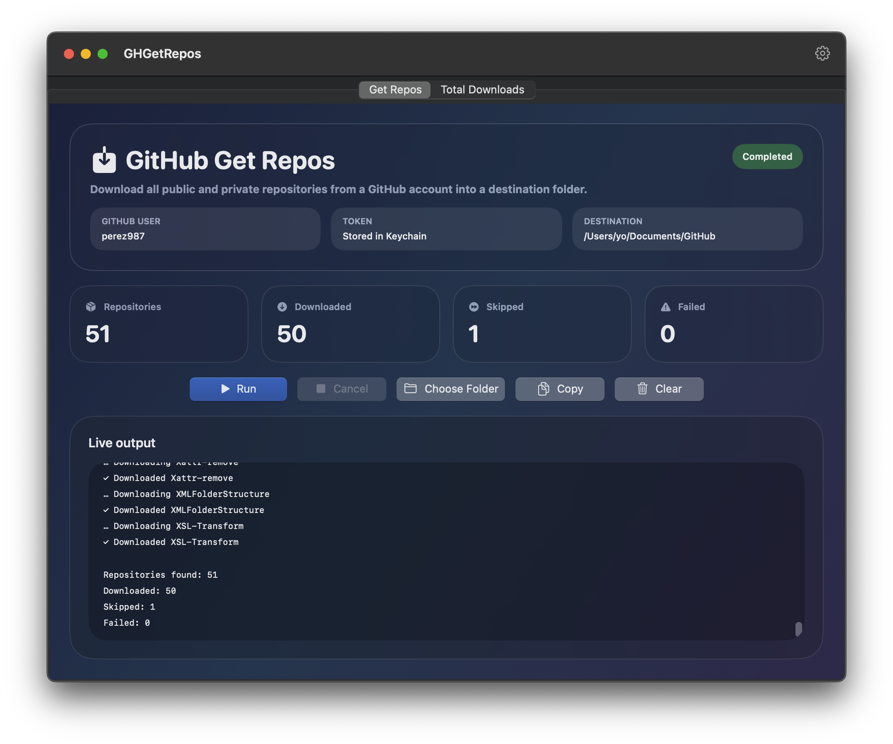
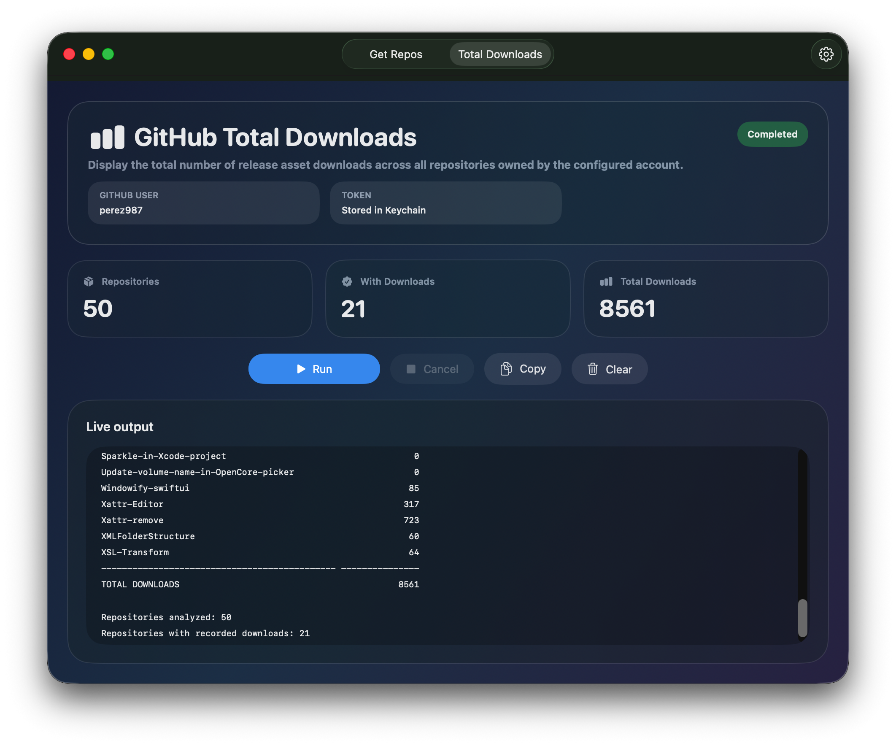
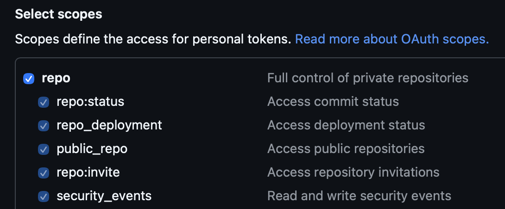
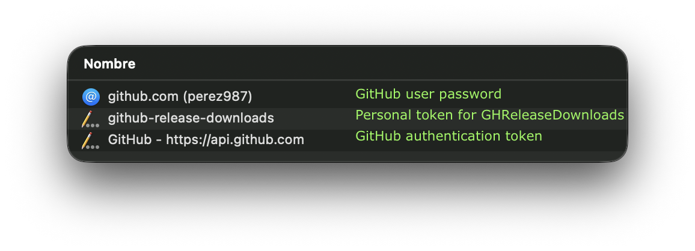

# GH Get Repos: fetch all GitHub repositories or know the total count of asset downloads

GH Get Repos is a native macOS app built with SwiftUI that:

- downloads all repositories from a GitHub account, including private repositories, into a user-selected destination folder
- counts release downloads from all repositories in a GitHub account; this is the SwiftUI evolution of a previous Bash script that performs the same task in the Terminal. This script is located in the `Bash-script` folder.

## Features

- Native SwiftUI macOS interface with soft gradients and glass-style panels
- Latest GitHub username saved locally in `UserDefaults`
- GitHub classic private token stored securely in the macOS Keychain under the `github-repo-downloads` service
- Destination folder picker
- Authenticated repository listing for the configured account
- Per-repository download into its own folder
- Live output log with copy, clear, and cancel actions
- Language system with selector in the Settings window
- Xcode project with hardened runtime and App Sandbox enabled.

## Requirements

- macOS 14 or later
- Xcode 16 or later
- Swift 5

## Tab 1: Get Repos

|                              |
| :--------------------------- |
|  |

## Tab 2: Total Downloads

|                              |
| :--------------------------- |
|  |

## Xcode project

Open `GHGetRepos.xcodeproj` in Xcode 16 or later and run the **GHGetRepos** scheme.

## Configure credentials

1. Open **Settings**
2. Enter the GitHub username to query
3. Paste the GitHub classic token into the secure field
4. Save the token to the Keychain.

The app uses the Keychain service name `github-release-downloads`. The app does not save the token as plain text.

> When the user clicks the text field for entering the classic token, a link to the Passwords app appears automatically because it is a SecureField; however, the classic token value is stored in the Keychain rather than in Passwords, making this link useless.

## Authentication with a Personal Access Token Classic

A Personal Access Token (classic) is used to authenticate requests to the GitHub API. For this app, which queries public and private data, you must generate a classic token with `repo` scope, as in the image:

|                                    |
| :--------------------------------- |
|  |

### Create the token

1. On GitHub, open **Settings**
2. Go to **Credentials**
3. Open **Personal access tokens (classic)**
4. Click **Generate new token** >> **Generate new token (classic)**
5. Assign a description, for example: `macOS get-repos`
6. Choose an appropriate expiration (7, 30, 60, 90 days, custom, or no expiration date)
7. Select `repo` scope
8. Click **Generate token** and copy it immediately. GitHub does not show the full value again later.

### Keychain

For the app to work, three items must exist in the Keychain:

- the user's GitHub login password
- the personal GitHub classic token (`github-release-downloads` service)
- the authentication password for accessing GitHub from apps (`git` or `gh` in Terminal, GitHub Desktop, etc.).

Two of these—the user password and the authentication password—should already exist if you use GitHub on the web and your Mac; you would only need to add the classic token when using this app.

|                                  |
| :------------------------------- |
|  |

## Motivation and download behavior

The app authenticates with the GitHub API, validates that the configured username matches the authenticated token owner, fetches only repositories owned by that account, and downloads a snapshot of each repository's default branch as a tarball through the GitHub API, extracting it with `/usr/bin/tar` inside the app container before moving it into the destination folder.

The app does not run `git`: under the App Sandbox, `/usr/bin/git` is an `xcrun` shim that refuses to run (`xcrun: error: cannot be used within an App Sandbox`). As a result, downloaded folders contain the repository files but no `.git` directory or history.

Think of this app as a very simple way to back up all your GitHub repositories. The destination folder should not be your working repository folder, as it lacks the `.git` folder containing the change history. In the event of an issue requiring you to restore a repository's contents or recreate it from scratch, you can upload the backup files from your computer to GitHub.

The destination folder is remembered with a security-scoped bookmark, so the sandboxed app keeps access to it after relaunch.

If a destination folder for a repository already exists, the app replaces that repository rather than skipping local files. If a non-folder item already exists at that path, the app reports the repository as a failure instead.
